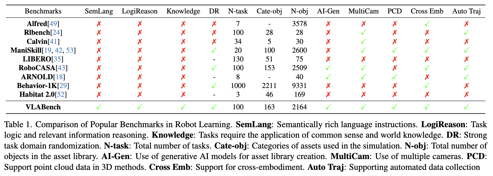
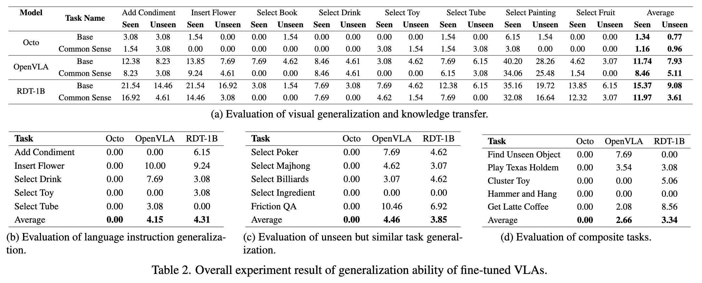
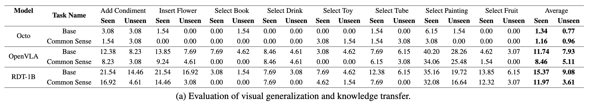
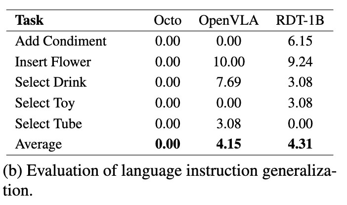
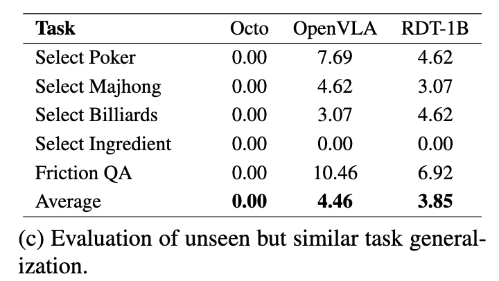
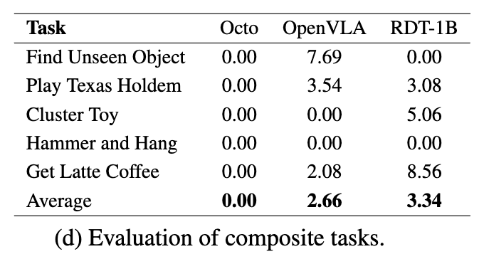

**Table 1: Comparison of Popular Benchmarks in Robot Learning.**

| Benchmarks | SemLang | LogiReason | Knowledge | DR | N-task | Cate-obj | N-obj | AI-Gen | MultiCam | PCD | Cross Emb | Auto Traj |
|---|---|---|---|---|---|---|---|---|---|---|---|---|
| Alfred[49] | ✗ | ✗ | ✗ | ✗ | 7 | – | 3578 | ✗ | ✗ | ✗ | ✓ | ✗ |
| Rlbench[24] | ✗ | ✗ | ✗ | ✗ | 100 | 28 | 28 | ✗ | ✓ | ✗ | ✗ | ✓ |
| Calvin[41] | ✗ | ✗ | ✗ | ✗ | 34 | 5 | 30 | ✗ | ✓ | ✗ | ✗ | ✗ |
| ManiSkill[19, 42, 53] | ✗ | ✗ | ✗ | ✓ | 20 | 100 | 2600 | ✗ | ✓ | ✓ | ✓ | ✓ |
| LIBERO[35] | ✗ | ✗ | ✗ | – | 130 | 51 | 75 | ✗ | ✗ | ✗ | ✗ | ✗ |
| RoboCASA[43] | ✗ | ✗ | ✗ | ✓ | 100 | 153 | 2509 | ✓ | ✓ | ✗ | ✓ | ✓ |
| ARNOLD[18] | ✗ | ✗ | ✗ | – | 8 | – | 40 | ✓ | ✓ | ✓ | ✗ | ✓ |
| Behavior-1K[29] | ✗ | ✗ | ✗ | ✓ | 1000 | 2211 | 9331 | ✗ | ✗ | ✗ | ✓ | ✗ |
| Habitat 2.0[52] | ✗ | ✗ | ✗ | – | 3 | 46 | 169 | ✗ | ✗ | ✗ | ✗ | ✗ |
| VLABench | ✓ | ✓ | ✓ | ✓ | 100 | 163 | 2164 | ✓ | ✓ | ✓ | ✓ | ✓ |

---

**Table 2: Overall experiment result of generalization ability of fine-tuned VLAs.**

**(a) Evaluation of visual generalization and knowledge transfer.**

| Model | Task Name | Add Condiment Seen | Add Condiment Unseen | Insert Flower Seen | Insert Flower Unseen | Select Book Seen | Select Book Unseen | Select Drink Seen | Select Drink Unseen | Select Toy Seen | Select Toy Unseen | Select Tube Seen | Select Tube Unseen | Select Painting Seen | Select Painting Unseen | Select Fruit Seen | Select Fruit Unseen | Average Seen | Average Unseen |
|---|---|---|---|---|---|---|---|---|---|---|---|---|---|---|---|---|---|---|---|
| Octo | Base | 3.08 | 3.08 | 1.54 | 0.00 | 0.00 | 1.54 | 0.00 | 0.00 | 0.00 | 0.00 | 1.54 | 0.00 | 6.15 | 1.54 | 0.00 | 0.00 | **1.34** | **0.77** |
|  | Common Sense | 1.54 | 3.08 | 0.00 | 0.00 | 0.00 | 0.00 | 0.00 | 0.00 | 3.08 | 1.54 | 1.54 | 3.08 | 3.08 | 0.00 | 0.00 | 0.00 | **1.16** | **0.96** |
| OpenVLA | Base | 12.38 | 8.23 | 13.85 | 7.69 | 7.69 | 4.62 | 8.46 | 4.61 | 3.08 | 4.62 | 7.69 | 6.15 | 40.20 | 28.26 | 4.62 | 3.07 | **11.74** | **7.93** |
|  | Common Sense | 8.23 | 3.08 | 9.24 | 4.61 | 0.00 | 0.00 | 8.46 | 4.61 | 0.00 | 0.00 | 6.15 | 3.08 | 34.06 | 25.48 | 1.54 | 0.00 | **8.46** | **5.11** |
| RDT-1B | Base | 21.54 | 14.46 | 21.54 | 16.92 | 3.08 | 1.54 | 7.69 | 3.08 | 7.69 | 4.62 | 12.38 | 6.15 | 35.16 | 19.72 | 13.85 | 6.15 | **15.37** | **9.08** |
|  | Common Sense | 16.92 | 4.61 | 14.46 | 3.08 | 0.00 | 0.00 | 7.69 | 0.00 | 4.62 | 1.54 | 7.69 | 0.00 | 32.08 | 16.64 | 12.32 | 3.07 | **11.97** | **3.61** |

**(b) Evaluation of language instruction generalization.**

| Task | Octo | OpenVLA | RDT-1B |
|---|---|---|---|
| Add Condiment | 0.00 | 0.00 | 6.15 |
| Insert Flower | 0.00 | 10.00 | 9.24 |
| Select Drink | 0.00 | 7.69 | 3.08 |
| Select Toy | 0.00 | 0.00 | 3.08 |
| Select Tube | 0.00 | 3.08 | 0.00 |
| Average | **0.00** | **4.15** | **4.31** |

**(c) Evaluation of unseen but similar task generalization.**

| Task | Octo | OpenVLA | RDT-1B |
|---|---|---|---|
| Select Poker | 0.00 | 7.69 | 4.62 |
| Select Majhong | 0.00 | 4.62 | 3.07 |
| Select Billiards | 0.00 | 3.07 | 4.62 |
| Select Ingredient | 0.00 | 0.00 | 0.00 |
| Friction QA | 0.00 | 10.46 | 6.92 |
| Average | **0.00** | **4.46** | **3.85** |

**(d) Evaluation of composite tasks.**

| Task | Octo | OpenVLA | RDT-1B |
|---|---|---|---|
| Find Unseen Object | 0.00 | 7.69 | 0.00 |
| Play Texas Holdem | 0.00 | 3.54 | 3.08 |
| Cluster Toy | 0.00 | 0.00 | 5.06 |
| Hammer and Hang | 0.00 | 0.00 | 0.00 |
| Get Latte Coffee | 0.00 | 2.08 | 8.56 |
| Average | **0.00** | **2.66** | **3.34** |
