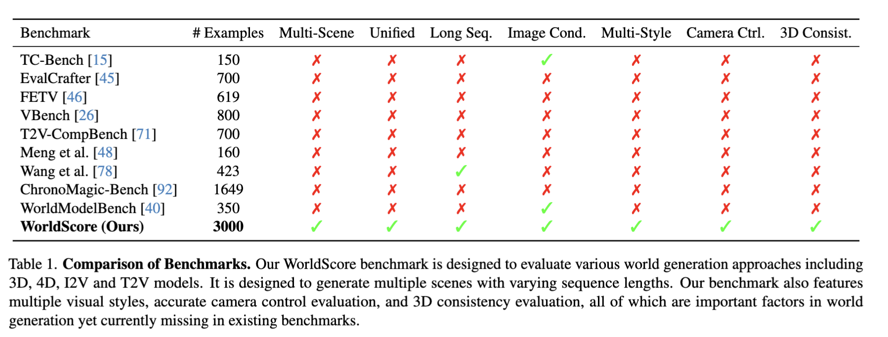
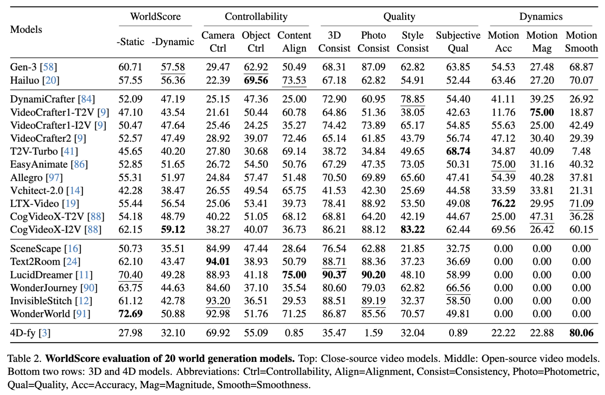

**Table 1: Comparison of Benchmarks. Our WorldScore benchmark is designed to evaluate various world generation approaches including 3D, 4D, I2V and T2V models. It is designed to generate multiple scenes with varying sequence lengths. Our benchmark also features multiple visual styles, accurate camera control evaluation, and 3D consistency evaluation, all of which are important factors in world generation yet currently missing in existing benchmarks.**

| Benchmark | # Examples | Multi-Scene | Unified | Long Seq. | Image Cond. | Multi-Style | Camera Ctrl. | 3D Consist. |
|---|---|---|---|---|---|---|---|---|
| TC-Bench [15] | 150 | ✗ | ✗ | ✗ | ✓ | ✗ | ✗ | ✗ |
| EvalCrafter [45] | 700 | ✗ | ✗ | ✗ | ✗ | ✗ | ✗ | ✗ |
| FETV [46] | 619 | ✗ | ✗ | ✗ | ✗ | ✗ | ✗ | ✗ |
| VBench [26] | 800 | ✗ | ✗ | ✗ | ✗ | ✗ | ✗ | ✗ |
| T2V-CompBench [71] | 700 | ✗ | ✗ | ✗ | ✗ | ✗ | ✗ | ✗ |
| Meng et al. [48] | 160 | ✗ | ✗ | ✗ | ✗ | ✗ | ✗ | ✗ |
| Wang et al. [78] | 423 | ✗ | ✗ | ✓ | ✗ | ✗ | ✗ | ✗ |
| ChronoMagic-Bench [92] | 1649 | ✗ | ✗ | ✗ | ✗ | ✗ | ✗ | ✗ |
| WorldModelBench [40] | 350 | ✗ | ✗ | ✗ | ✓ | ✗ | ✗ | ✗ |
| WorldScore (Ours) | 3000 | ✓ | ✓ | ✓ | ✓ | ✓ | ✓ | ✓ |

---

**Table 2: WorldScore evaluation of 20 world generation models. Top: Close-source video models. Middle: Open-source video models. Bottom two rows: 3D and 4D models. Abbreviations: Ctrl=Controllability, Align=Alignment, Consist=Consistency, Photo=Photometric, Qual=Quality, Acc=Accuracy, Mag=Magnitude, Smooth=Smoothness.**

| Models | WorldScore -Static | WorldScore -Dynamic | Controllability Camera Ctrl | Controllability Object Ctrl | Controllability Content Align | Controllability 3D Consist | Quality Photo Consist | Quality Style Consist | Quality Subjective Qual | Dynamics Motion Acc | Dynamics Motion Mag | Dynamics Motion Smooth |
|---|---|---|---|---|---|---|---|---|---|---|---|---|
| Gen-3 [58] | 60.71 | <u>57.58</u> | 29.47 | <u>62.92</u> | 50.49 | 68.31 | 87.09 | 62.82 | 63.85 | 54.53 | 27.48 | 68.87 |
| Hailuo [20] | 57.55 | 56.36 | 22.39 | **69.56** | <u>73.53</u> | 67.18 | 62.82 | 54.91 | 52.44 | 63.46 | 27.20 | 70.07 |
| DynamiCrafter [84] | 52.09 | 47.19 | 25.15 | 47.36 | 25.00 | 72.90 | 60.95 | <u>78.85</u> | 54.40 | 41.11 | 39.25 | 26.92 |
| VideoCrafter1-T2V [9] | 47.10 | 43.54 | 21.61 | 50.44 | 60.78 | 64.86 | 51.36 | 38.05 | 42.63 | 11.76 | **75.00** | 18.87 |
| VideoCrafter1-I2V [9] | 50.47 | 47.64 | 25.46 | 24.25 | 35.27 | 74.42 | 73.89 | 65.17 | 54.85 | 55.63 | 25.00 | 42.49 |
| VideoCrafter2 [9] | 52.57 | 47.49 | 28.92 | 39.07 | 72.46 | 65.14 | 61.85 | 43.79 | 56.74 | 47.12 | 30.40 | 29.39 |
| T2V-Turbo [41] | 45.65 | 40.20 | 27.80 | 30.68 | 69.14 | 38.72 | 34.84 | 49.65 | **68.74** | 34.87 | 40.09 | 7.48 |
| EasyAnimate [86] | 52.85 | 51.65 | 26.72 | 54.50 | 50.76 | 67.29 | 47.35 | 73.05 | 50.31 | <u>75.00</u> | 31.16 | 40.32 |
| Allegro [97] | 55.31 | 51.97 | 24.84 | 57.47 | 51.48 | 70.50 | 69.89 | 65.60 | 47.41 | 54.39 | 40.28 | 37.81 |
| Vchitect-2.0 [14] | 42.28 | 38.47 | 26.55 | 49.54 | 65.75 | 41.53 | 42.30 | 25.69 | 44.58 | 33.59 | 33.81 | 21.31 |
| LTX-Video [19] | 55.44 | 56.54 | 25.06 | 53.41 | 39.73 | 78.41 | 88.92 | 53.50 | 49.08 | **76.22** | 29.95 | <u>71.09</u> |
| CogVideoX-T2V [88] | 54.18 | 48.79 | 40.22 | 51.05 | 68.12 | 68.81 | 64.20 | 42.19 | 44.67 | 25.00 | <u>47.31</u> | 36.28 |
| CogVideoX-I2V [88] | 62.15 | **59.12** | 38.27 | 40.07 | 36.73 | 86.21 | 88.12 | **83.22** | 62.44 | 69.56 | 26.42 | 60.15 |
| SceneScape [16] | 50.73 | 35.51 | 84.99 | 47.44 | 28.64 | 76.54 | 62.88 | 21.85 | 32.75 | 0.00 | 0.00 | 0.00 |
| Text2Room [24] | 62.10 | 43.47 | **94.01** | 38.93 | 50.79 | <u>88.71</u> | 88.36 | 37.23 | 36.69 | 0.00 | 0.00 | 0.00 |
| LucidDreamer [11] | <u>70.40</u> | 49.28 | 88.93 | 41.18 | **75.00** | **90.37** | **90.20** | 48.10 | 58.99 | 0.00 | 0.00 | 0.00 |
| WonderJourney [90] | 63.75 | 44.63 | 84.60 | 37.10 | 35.54 | 80.60 | 79.03 | 62.82 | <u>66.56</u> | 0.00 | 0.00 | 0.00 |
| InvisibleStitch [12] | 61.12 | 42.78 | <u>93.20</u> | 36.51 | 29.53 | 88.51 | <u>89.19</u> | 32.37 | 58.50 | 0.00 | 0.00 | 0.00 |
| WonderWorld [91] | **72.69** | 50.88 | 92.98 | 51.76 | 71.25 | 86.87 | 85.56 | 70.57 | 49.81 | 0.00 | 0.00 | 0.00 |
| 4D-fy [3] | 27.98 | 32.10 | 69.92 | 55.09 | 0.85 | 35.47 | 1.59 | 32.04 | 0.89 | 22.22 | 22.88 | **80.06** |
