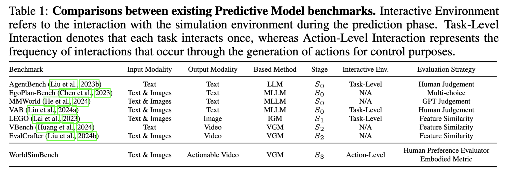
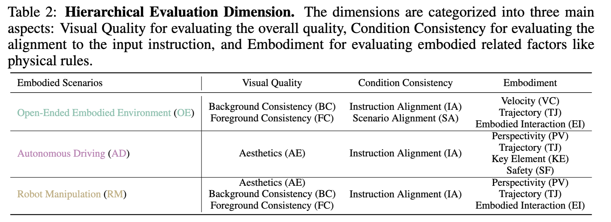
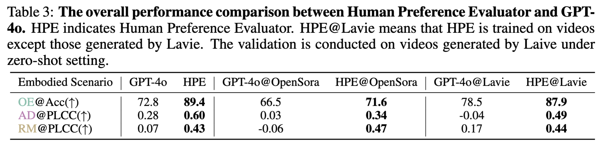

**Table 1: Comparisons between existing Predictive Model benchmarks. Interactive Environment refers to the interaction with the simulation environment during the prediction phase. Task-Level Interaction denotes that each task interacts once, whereas Action-Level Interaction represents the frequency of interactions that occur through the generation of actions for control purposes.**

| Benchmark | Input Modality | Output Modality | Based Method | Stage | Interactive Env. | Evaluation Strategy |
|---|---|---|---|---|---|---|
| AgentBench (Liu et al., 2023b) | Text | Text | LLM | S0 | Task-Level | Human Judgement |
| EgoPlan-Bench (Chen et al., 2023) | Text & Images | Text | MLLM | S0 | N/A | Multi-choice |
| MMWorld (He et al., 2024) | Text & Images | Text | MLLM | S0 | N/A | GPT Judgement |
| VAB (Liu et al., 2024a) | Text & Images | Text | MLLM | S0 | Task-Level | Human Judgement |
| LEGO (Lai et al., 2023) | Text & Images | Image | IGM | S1 | Task-Level | Feature Similarity |
| VBench (Huang et al., 2024) | Text | Video | VGM | S2 | N/A | Feature Similarity |
| EvalCrafter (Liu et al., 2024b) | Text & Images | Video | VGM | S2 | N/A | Feature Similarity |
| WorldSimBench | Text & Images | Actionable Video | VGM | S3 | Action-Level | Human Preference Evaluator Embodied Metric |

---

**Table 2: Hierarchical Evaluation Dimension. The dimensions are categorized into three main aspects: Visual Quality for evaluating the overall quality, Condition Consistency for evaluating the alignment to the input instruction, and Embodiment for evaluating embodied related factors like physical rules.**

| Embodied Scenarios | Visual Quality | Condition Consistency | Embodiment |
|---|---|---|---|
| Open-Ended Embodied Environment (OE) | Background Consistency (BC) Foreground Consistency (FC) | Instruction Alignment (IA) Scenario Alignment (SA) | Velocity (VC) Trajectory (TJ) Embodied Interaction (EI) |
| Autonomous Driving (AD) | Aesthetics (AE) | Instruction Alignment (IA) | Perspectivity (PV) Trajectory (TJ) Key Element (KE) Safety (SF) |
| Robot Manipulation (RM) | Aesthetics (AE) Background Consistency (BC) Foreground Consistency (FC) | Instruction Alignment (IA) | Perspectivity (PV) Trajectory (TJ) Embodied Interaction (EI) |

---

**Table 3: The overall performance comparison between Human Preference Evaluator and GPT-4o. HPE indicates Human Preference Evaluator. HPE@Lavie means that HPE is trained on videos except those generated by Lavie. The validation is conducted on videos generated by Laive under zero-shot setting.**

| Embodied Scenario | GPT-4o | HPE | GPT-4o@OpenSora | HPE@OpenSora | GPT-4o@Lavie | HPE@Lavie |
|---|---|---|---|---|---|---|
| OE@Acc(↑) | 72.8 | **89.4** | 66.5 | **71.6** | 78.5 | **87.9** |
| AD@PLCC(↑) | 0.28 | **0.60** | 0.03 | **0.34** | -0.04 | **0.49** |
| RM@PLCC(↑) | 0.07 | **0.43** | -0.06 | **0.47** | 0.17 | **0.44** |
