# Paper 1 — World-in-World: World Models in a Closed-Loop World

**Table 1: Active Recognition (AR) and Image-Goal Navigation (ImageNav) performance across various models and base policies. Higher success rate (SR%), success weighted by path length (SPL%), and lower mean trajectory length (Mean Traj.) are better. "†" denotes our post-trained video generators.**

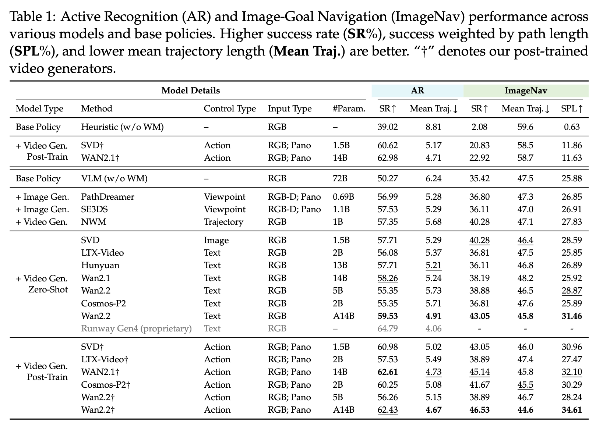

| Model Type | Method | Control Type | Input Type | #Param. | AR SR↑ | AR Mean Traj.↓ | ImageNav SR↑ | ImageNav Mean Traj.↓ | ImageNav SPL↑ |
|---|---|---|---|---|---|---|---|---|---|
| Base Policy | Heuristic (w/o WM) | – | RGB | – | 39.02 | 8.81 | 2.08 | 59.6 | 0.63 |
| + Video Gen. Post-Train | SVD† | Action | RGB; Pano | 1.5B | <u>60.62</u> | <u>5.17</u> | <u>20.83</u> | **58.5** | **11.86** |
|  | WAN2.1† | Action | RGB; Pano | 14B | **62.98** | **4.71** | **22.92** | <u>58.7</u> | <u>11.63</u> |
| Base Policy | VLM (w/o WM) | – | RGB | 72B | 50.27 | 6.24 | 35.42 | 47.5 | 25.88 |
| + Image Gen. | PathDreamer | Viewpoint | RGB-D; Pano | 0.69B | 56.99 | 5.28 | 36.80 | 47.3 | 26.85 |
| + Image Gen. | SE3DS | Viewpoint | RGB-D; Pano | 1.1B | 57.53 | 5.29 | 36.11 | 47.0 | 26.91 |
| + Video Gen. | NWM | Trajectory | RGB | 1B | 57.35 | 5.68 | 40.28 | 47.1 | 27.83 |
| + Video Gen. Zero-Shot | SVD | Image | RGB | 1.5B | 57.71 | 5.29 | <u>40.28</u> | <u>46.4</u> | <u>28.59</u> |
|  | LTX-Video | Text | RGB | 2B | 56.08 | 5.37 | 36.81 | 47.5 | 25.85 |
|  | Hunyuan | Text | RGB | 13B | 57.71 | 5.21 | 36.11 | 46.8 | 26.89 |
|  | Wan2.1 | Text | RGB | 14B | 58.26 | 5.24 | 38.19 | 48.2 | 25.92 |
|  | Wan2.2 | Text | RGB | 5B | 55.35 | 5.73 | 38.88 | 46.5 | <u>28.87</u> |
|  | Cosmos-P2 | Text | RGB | 2B | 55.35 | 5.71 | 36.81 | 47.6 | 25.89 |
|  | Wan2.2 | Text | RGB | A14B | <u>59.53</u> | <u>4.91</u> | **43.05** | **45.8** | **31.46** |
|  | Runway Gen4 (proprietary) | Text | RGB | – | **64.79** | **4.06** | - | - | - |
| + Video Gen. Post-Train | SVD† | Action | RGB; Pano | 1.5B | 60.98 | 5.02 | 43.05 | 46.0 | 30.96 |
|  | LTX-Video† | Action | RGB; Pano | 2B | 57.53 | 5.49 | 38.89 | 47.4 | 27.47 |
|  | WAN2.1† | Action | RGB; Pano | 14B | **62.61** | <u>4.73</u> | <u>45.14</u> | 45.8 | <u>32.10</u> |
|  | Cosmos-P2† | Action | RGB; Pano | 2B | 60.25 | 5.08 | 41.67 | <u>45.5</u> | 30.29 |
|  | Wan2.2† | Action | RGB; Pano | 5B | 56.26 | 5.15 | 38.89 | 46.7 | 28.24 |
|  | Wan2.2† | Action | RGB; Pano | A14B | <u>62.43</u> | **4.67** | **46.53** | **44.6** | **34.61** |

---

**Table 2: Active Embodied Question Answering (A-EQA) performance.**

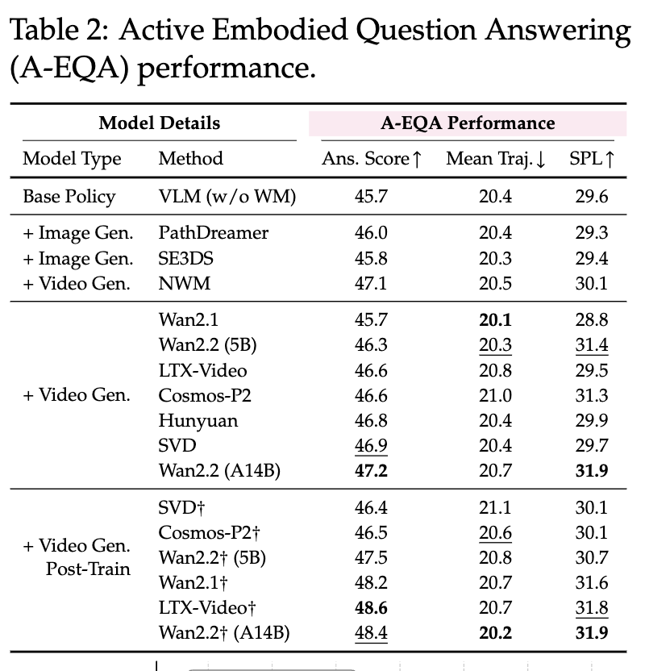

| Model Type | Method | Ans. Score↑ | Mean Traj.↓ | SPL↑ |
|---|---|---|---|---|
| Base Policy | VLM (w/o WM) | 45.7 | 20.4 | 29.6 |
| + Image Gen. | PathDreamer | 46.0 | 20.4 | 29.3 |
| + Image Gen. | SE3DS | 45.8 | 20.3 | 29.4 |
| + Video Gen. | NWM | 47.1 | 20.5 | 30.1 |
| + Video Gen. | Wan2.1 | 45.7 | **20.1** | 28.8 |
|  | Wan2.2 (5B) | 46.3 | <u>20.3</u> | <u>31.4</u> |
|  | LTX-Video | 46.6 | 20.8 | 29.5 |
|  | Cosmos-P2 | 46.6 | 21.0 | 31.3 |
|  | Hunyuan | 46.8 | 20.4 | 29.9 |
|  | SVD | <u>46.9</u> | 20.4 | 29.7 |
|  | Wan2.2 (A14B) | **47.2** | 20.7 | **31.9** |
| + Video Gen. Post-Train | SVD† | 46.4 | 21.1 | 30.1 |
|  | Cosmos-P2† | 46.5 | <u>20.6</u> | 30.1 |
|  | Wan2.2† (5B) | 47.5 | 20.8 | 30.7 |
|  | Wan2.1† | 48.2 | 20.7 | 31.6 |
|  | LTX-Video† | **48.6** | 20.7 | <u>31.8</u> |
|  | Wan2.2† (A14B) | <u>48.4</u> | **20.2** | **31.9** |

---

**Table 3: Robotic manipulation performance across various models and base policies.**

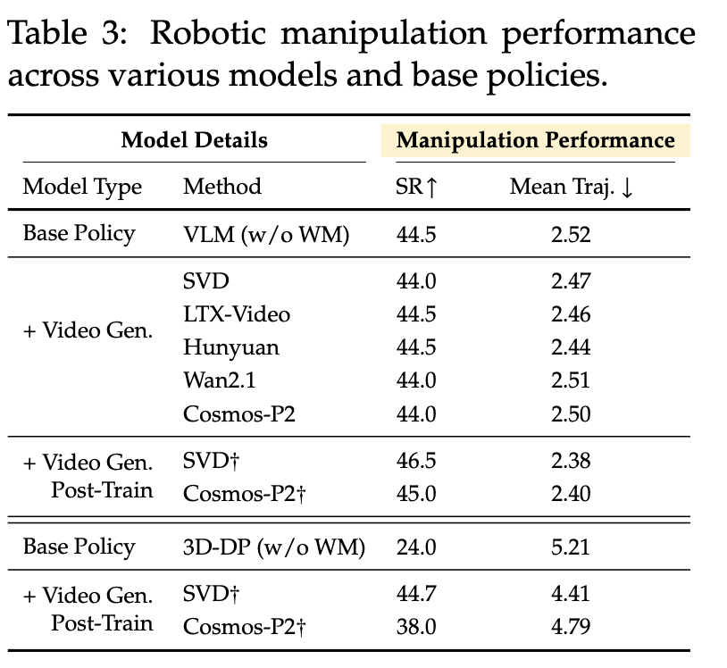

| Model Type | Method | SR↑ | Mean Traj.↓ |
|---|---|---|---|
| Base Policy | VLM (w/o WM) | 44.5 | 2.52 |
| + Video Gen. | SVD | 44.0 | 2.47 |
|  | LTX-Video | 44.5 | 2.46 |
|  | Hunyuan | 44.5 | 2.44 |
|  | Wan2.1 | 44.0 | 2.51 |
|  | Cosmos-P2 | 44.0 | 2.50 |
| + Video Gen. Post-Train | SVD† | 46.5 | 2.38 |
|  | Cosmos-P2† | 45.0 | 2.40 |
| Base Policy | 3D-DP (w/o WM) | 24.0 | 5.21 |
| + Video Gen. Post-Train | SVD† | 44.7 | 4.41 |
|  | Cosmos-P2† | 38.0 | 4.79 |

---

**Table 4: Post-training with different input contexts: front view vs. panorama.**

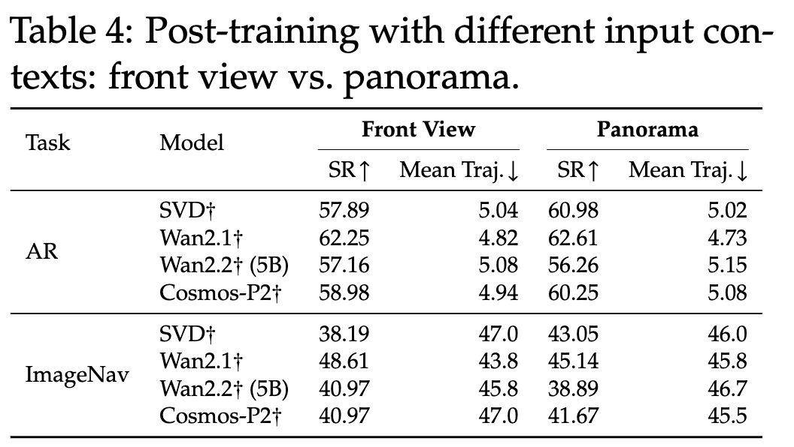

| Task | Model | Front View SR↑ | Front View Mean Traj.↓ | Panorama SR↑ | Panorama Mean Traj.↓ |
|---|---|---|---|---|---|
| AR | SVD† | 57.89 | 5.04 | 60.98 | 5.02 |
|  | Wan2.1† | 62.25 | 4.82 | 62.61 | 4.73 |
|  | Wan2.2† (5B) | 57.16 | 5.08 | 56.26 | 5.15 |
|  | Cosmos-P2† | 58.98 | 4.94 | 60.25 | 5.08 |
| ImageNav | SVD† | 38.19 | 47.0 | 43.05 | 46.0 |
|  | Wan2.1† | 48.61 | 43.8 | 45.14 | 45.8 |
|  | Wan2.2† (5B) | 40.97 | 45.8 | 38.89 | 46.7 |
|  | Cosmos-P2† | 40.97 | 47.0 | 41.67 | 45.5 |

---

# Paper 2 — WorldArena: A Unified Benchmark for Evaluating Perception and Functional Utility of Embodied World Models

**Table 1: Comparison of existing world model benchmarks and WorldArena across three key evaluation dimensions.**

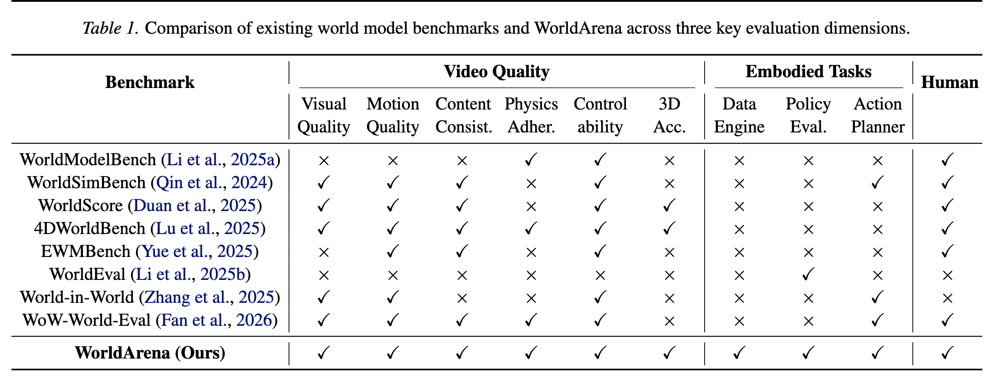

| Benchmark | Video Quality Visual Quality | Video Quality Motion Quality | Video Quality Content Consist. | Video Quality Physics Adher. | Video Quality Control ability | Video Quality 3D Acc. | Embodied Tasks Data Engine | Embodied Tasks Policy Eval. | Embodied Tasks Action Planner | Human |
|---|---|---|---|---|---|---|---|---|---|---|
| WorldModelBench (Li et al., 2025a) | ✗ | ✗ | ✗ | ✓ | ✓ | ✗ | ✗ | ✗ | ✗ | ✓ |
| WorldSimBench (Qin et al., 2024) | ✓ | ✓ | ✓ | ✗ | ✓ | ✗ | ✗ | ✗ | ✓ | ✓ |
| WorldScore (Duan et al., 2025) | ✓ | ✓ | ✓ | ✗ | ✓ | ✓ | ✗ | ✗ | ✗ | ✓ |
| 4DWorldBench (Lu et al., 2025) | ✓ | ✓ | ✓ | ✓ | ✓ | ✓ | ✗ | ✗ | ✗ | ✓ |
| EWMBench (Yue et al., 2025) | ✗ | ✓ | ✓ | ✗ | ✓ | ✗ | ✗ | ✗ | ✗ | ✓ |
| WorldEval (Li et al., 2025b) | ✗ | ✗ | ✗ | ✗ | ✗ | ✗ | ✗ | ✓ | ✗ | ✗ |
| World-in-World (Zhang et al., 2025) | ✓ | ✓ | ✗ | ✗ | ✓ | ✗ | ✗ | ✗ | ✓ | ✗ |
| WoW-World-Eval (Fan et al., 2026) | ✓ | ✓ | ✓ | ✓ | ✓ | ✗ | ✗ | ✗ | ✓ | ✓ |
| **WorldArena (Ours)** | ✓ | ✓ | ✓ | ✓ | ✓ | ✓ | ✓ | ✓ | ✓ | ✓ |

---

**Table 2: Video quality evaluation results across visual quality, motion quality and content consistency dimensions.**

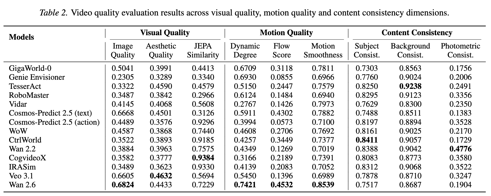

| Models | Visual Quality Image Quality | Visual Quality Aesthetic Quality | Visual Quality JEPA Similarity | Motion Quality Dynamic Degree | Motion Quality Flow Score | Motion Quality Motion Smoothness | Content Consistency Subject Consist. | Content Consistency Background Consist. | Content Consistency Photometric Consist. |
|---|---|---|---|---|---|---|---|---|---|
| GigaWorld-0 | 0.5041 | 0.3991 | 0.4413 | 0.6709 | 0.3118 | 0.7811 | 0.7303 | 0.8563 | 0.1756 |
| Genie Envisioner | 0.2305 | 0.3289 | 0.3340 | <u>0.6930</u> | 0.0855 | 0.6966 | 0.7760 | 0.9024 | 0.2006 |
| TesserAct | 0.3322 | <u>0.4590</u> | 0.4579 | 0.5150 | 0.2447 | 0.7579 | 0.8250 | **0.9238** | 0.2491 |
| RoboMaster | 0.3487 | 0.3842 | 0.2966 | 0.6124 | 0.1484 | 0.6940 | 0.8295 | <u>0.9123</u> | 0.3356 |
| Vidar | 0.4145 | 0.4068 | 0.5608 | 0.2767 | 0.1426 | <u>0.7973</u> | 0.7629 | 0.8300 | 0.2350 |
| Cosmos-Predict 2.5 (text) | <u>0.6668</u> | 0.4501 | 0.3126 | 0.5911 | <u>0.4302</u> | 0.7882 | 0.7488 | 0.8511 | 0.1383 |
| Cosmos-Predict 2.5 (action) | 0.4489 | 0.3576 | 0.9296 | 0.3994 | 0.0573 | 0.7100 | 0.8197 | 0.8894 | 0.3528 |
| WoW | 0.4587 | 0.3868 | 0.7440 | 0.4608 | 0.2706 | 0.7692 | 0.8161 | 0.9025 | 0.2170 |
| CtrlWorld | 0.3522 | 0.3893 | 0.9185 | 0.4257 | 0.3449 | 0.7377 | **0.8411** | 0.9057 | 0.1729 |
| Wan 2.2 | 0.3884 | 0.3963 | 0.7575 | 0.4349 | 0.1269 | 0.7019 | <u>0.8388</u> | 0.9042 | **0.4776** |
| CogvideoX | 0.3582 | 0.3777 | **0.9384** | 0.3166 | 0.2189 | 0.7391 | 0.8083 | 0.8773 | <u>0.3580</u> |
| IRASim | 0.3489 | 0.3623 | <u>0.9330</u> | 0.4139 | 0.2083 | 0.7052 | 0.8312 | 0.9068 | 0.3522 |
| Veo 3.1 | 0.6605 | **0.4632** | 0.5694 | 0.5450 | 0.1396 | 0.6989 | 0.7878 | 0.8710 | 0.3247 |
| Wan 2.6 | **0.6824** | 0.4433 | 0.7229 | **0.7421** | **0.4532** | **0.8539** | 0.7517 | 0.8687 | 0.1904 |

---

**Table 3: Video quality evaluation results across physics adherence, 3D accuracy and controllability dimensions.**

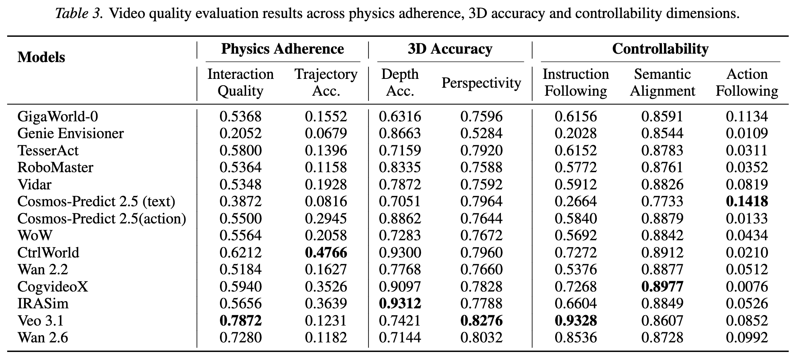

| Models | Physics Adherence Interaction Quality | Physics Adherence Trajectory Acc. | 3D Accuracy Depth Acc. | 3D Accuracy Perspectivity | Controllability Instruction Following | Controllability Semantic Alignment | Controllability Action Following |
|---|---|---|---|---|---|---|---|
| GigaWorld-0 | 0.5368 | 0.1552 | 0.6316 | 0.7596 | 0.6156 | 0.8591 | <u>0.1134</u> |
| Genie Envisioner | 0.2052 | 0.0679 | 0.8663 | 0.5284 | 0.2028 | 0.8544 | 0.0109 |
| TesserAct | 0.5800 | 0.1396 | 0.7159 | 0.7920 | 0.6152 | 0.8783 | 0.0311 |
| RoboMaster | 0.5364 | 0.1158 | 0.8335 | 0.7588 | 0.5772 | 0.8761 | 0.0352 |
| Vidar | 0.5348 | 0.1928 | 0.7872 | 0.7592 | 0.5912 | 0.8826 | 0.0819 |
| Cosmos-Predict 2.5 (text) | 0.3872 | 0.0816 | 0.7051 | 0.7964 | 0.2664 | 0.7733 | **0.1418** |
| Cosmos-Predict 2.5 (action) | 0.5500 | 0.2945 | 0.8862 | 0.7644 | 0.5840 | 0.8879 | 0.0133 |
| WoW | 0.5564 | 0.2058 | 0.7283 | 0.7672 | 0.5692 | 0.8842 | 0.0434 |
| CtrlWorld | 0.6212 | **0.4766** | <u>0.9300</u> | 0.7960 | 0.7272 | <u>0.8912</u> | 0.0210 |
| Wan 2.2 | 0.5184 | 0.1627 | 0.7768 | 0.7660 | 0.5376 | 0.8877 | 0.0512 |
| CogvideoX | 0.5940 | 0.3526 | 0.9097 | 0.7828 | 0.7268 | **0.8977** | 0.0076 |
| IRASim | 0.5656 | <u>0.3639</u> | **0.9312** | 0.7788 | 0.6604 | 0.8849 | 0.0526 |
| Veo 3.1 | **0.7872** | 0.1231 | 0.7421 | **0.8276** | **0.9328** | 0.8607 | 0.0852 |
| Wan 2.6 | <u>0.7280</u> | 0.1182 | 0.7144 | <u>0.8032</u> | <u>0.8536</u> | 0.8728 | 0.0992 |

---

**Table 4: Task success rate of downstream policy models trained with generated data from different world models.**

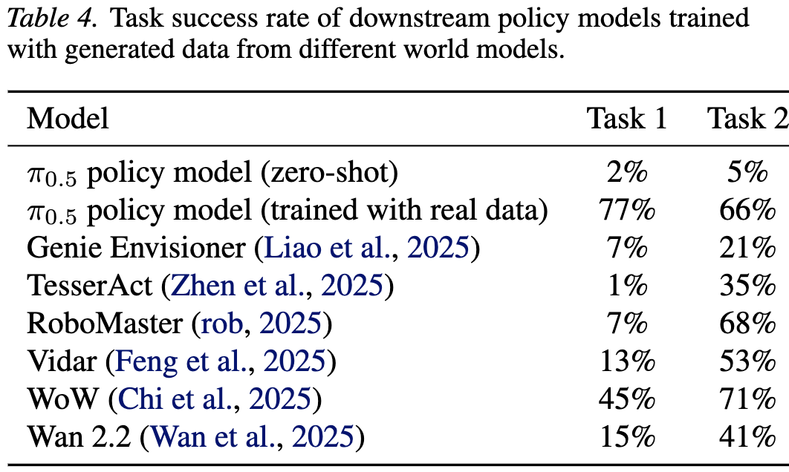

| Model | Task 1 | Task 2 |
|---|---|---|
| π0.5 policy model (zero-shot) | 2% | 5% |
| π0.5 policy model (trained with real data) | 77% | 66% |
| Genie Envisioner (Liao et al., 2025) | 7% | 21% |
| TesserAct (Zhen et al., 2025) | 1% | 35% |
| RoboMaster (rob, 2025) | 7% | 68% |
| Vidar (Feng et al., 2025) | 13% | 53% |
| WoW (Chi et al., 2025) | 45% | 71% |
| Wan 2.2 (Wan et al., 2025) | 15% | 41% |

---

**Table 5: Task success rate of different world models directly as action planners in the RoboTwin simulator.**

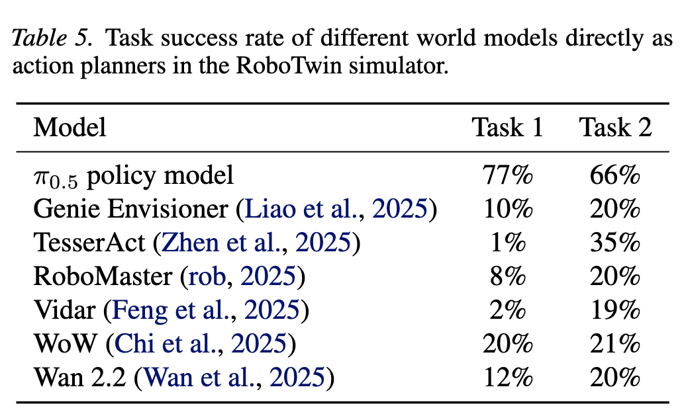

| Model | Task 1 | Task 2 |
|---|---|---|
| π0.5 policy model | 77% | 66% |
| Genie Envisioner (Liao et al., 2025) | 10% | 20% |
| TesserAct (Zhen et al., 2025) | 1% | 35% |
| RoboMaster (rob, 2025) | 8% | 20% |
| Vidar (Feng et al., 2025) | 2% | 19% |
| WoW (Chi et al., 2025) | 20% | 21% |
| Wan 2.2 (Wan et al., 2025) | 12% | 20% |

---

# Paper 3 — VLABench: A Large-Scale Benchmark for Language-Conditioned Robotics Manipulation with Long-Horizon Reasoning Tasks

**Table 1: Comparison of Popular Benchmarks in Robot Learning.**

| Benchmarks | SemLang | LogiReason | Knowledge | DR | N-task | Cate-obj | N-obj | AI-Gen | MultiCam | PCD | Cross Emb | Auto Traj |
|---|---|---|---|---|---|---|---|---|---|---|---|---|
| Alfred[49] | ✗ | ✗ | ✗ | ✗ | 7 | – | 3578 | ✗ | ✗ | ✗ | ✓ | ✗ |
| Rlbench[24] | ✗ | ✗ | ✗ | ✗ | 100 | 28 | 28 | ✗ | ✓ | ✗ | ✗ | ✓ |
| Calvin[41] | ✗ | ✗ | ✗ | ✗ | 34 | 5 | 30 | ✗ | ✓ | ✗ | ✗ | ✗ |
| ManiSkill[19, 42, 53] | ✗ | ✗ | ✗ | ✓ | 20 | 100 | 2600 | ✗ | ✓ | ✓ | ✓ | ✓ |
| LIBERO[35] | ✗ | ✗ | ✗ | – | 130 | 51 | 75 | ✗ | ✗ | ✗ | ✗ | ✗ |
| RoboCASA[43] | ✗ | ✗ | ✗ | ✓ | 100 | 153 | 2509 | ✓ | ✓ | ✗ | ✓ | ✓ |
| ARNOLD[18] | ✗ | ✗ | ✗ | – | 8 | – | 40 | ✓ | ✓ | ✓ | ✗ | ✓ |
| Behavior-1K[29] | ✗ | ✗ | ✗ | ✓ | 1000 | 2211 | 9331 | ✗ | ✗ | ✗ | ✓ | ✗ |
| Habitat 2.0[52] | ✗ | ✗ | ✗ | – | 3 | 46 | 169 | ✗ | ✗ | ✗ | ✗ | ✗ |
| VLABench | ✓ | ✓ | ✓ | ✓ | 100 | 163 | 2164 | ✓ | ✓ | ✓ | ✓ | ✓ |

---

**Table 2: Overall experiment result of generalization ability of fine-tuned VLAs.**

**(a) Evaluation of visual generalization and knowledge transfer.**

| Model | Task Name | Add Condiment Seen | Add Condiment Unseen | Insert Flower Seen | Insert Flower Unseen | Select Book Seen | Select Book Unseen | Select Drink Seen | Select Drink Unseen | Select Toy Seen | Select Toy Unseen | Select Tube Seen | Select Tube Unseen | Select Painting Seen | Select Painting Unseen | Select Fruit Seen | Select Fruit Unseen | Average Seen | Average Unseen |
|---|---|---|---|---|---|---|---|---|---|---|---|---|---|---|---|---|---|---|---|
| Octo | Base | 3.08 | 3.08 | 1.54 | 0.00 | 0.00 | 1.54 | 0.00 | 0.00 | 0.00 | 0.00 | 1.54 | 0.00 | 6.15 | 1.54 | 0.00 | 0.00 | **1.34** | **0.77** |
|  | Common Sense | 1.54 | 3.08 | 0.00 | 0.00 | 0.00 | 0.00 | 0.00 | 0.00 | 3.08 | 1.54 | 1.54 | 3.08 | 3.08 | 0.00 | 0.00 | 0.00 | **1.16** | **0.96** |
| OpenVLA | Base | 12.38 | 8.23 | 13.85 | 7.69 | 7.69 | 4.62 | 8.46 | 4.61 | 3.08 | 4.62 | 7.69 | 6.15 | 40.20 | 28.26 | 4.62 | 3.07 | **11.74** | **7.93** |
|  | Common Sense | 8.23 | 3.08 | 9.24 | 4.61 | 0.00 | 0.00 | 8.46 | 4.61 | 0.00 | 0.00 | 6.15 | 3.08 | 34.06 | 25.48 | 1.54 | 0.00 | **8.46** | **5.11** |
| RDT-1B | Base | 21.54 | 14.46 | 21.54 | 16.92 | 3.08 | 1.54 | 7.69 | 3.08 | 7.69 | 4.62 | 12.38 | 6.15 | 35.16 | 19.72 | 13.85 | 6.15 | **15.37** | **9.08** |
|  | Common Sense | 16.92 | 4.61 | 14.46 | 3.08 | 0.00 | 0.00 | 7.69 | 0.00 | 4.62 | 1.54 | 7.69 | 0.00 | 32.08 | 16.64 | 12.32 | 3.07 | **11.97** | **3.61** |

**(b) Evaluation of language instruction generalization.**

| Task | Octo | OpenVLA | RDT-1B |
|---|---|---|---|
| Add Condiment | 0.00 | 0.00 | 6.15 |
| Insert Flower | 0.00 | 10.00 | 9.24 |
| Select Drink | 0.00 | 7.69 | 3.08 |
| Select Toy | 0.00 | 0.00 | 3.08 |
| Select Tube | 0.00 | 3.08 | 0.00 |
| Average | **0.00** | **4.15** | **4.31** |

**(c) Evaluation of unseen but similar task generalization.**

| Task | Octo | OpenVLA | RDT-1B |
|---|---|---|---|
| Select Poker | 0.00 | 7.69 | 4.62 |
| Select Majhong | 0.00 | 4.62 | 3.07 |
| Select Billiards | 0.00 | 3.07 | 4.62 |
| Select Ingredient | 0.00 | 0.00 | 0.00 |
| Friction QA | 0.00 | 10.46 | 6.92 |
| Average | **0.00** | **4.46** | **3.85** |

**(d) Evaluation of composite tasks.**

| Task | Octo | OpenVLA | RDT-1B |
|---|---|---|---|
| Find Unseen Object | 0.00 | 7.69 | 0.00 |
| Play Texas Holdem | 0.00 | 3.54 | 3.08 |
| Cluster Toy | 0.00 | 0.00 | 5.06 |
| Hammer and Hang | 0.00 | 0.00 | 0.00 |
| Get Latte Coffee | 0.00 | 2.08 | 8.56 |
| Average | **0.00** | **2.66** | **3.34** |

---

# Paper 4 — WorldModelBench: Judging Video Generation Models As World Models

**Table 1: Comparison of WorldModelBench to other existing video benchmarks: VBench, VideoArena, and VideoPhy.**

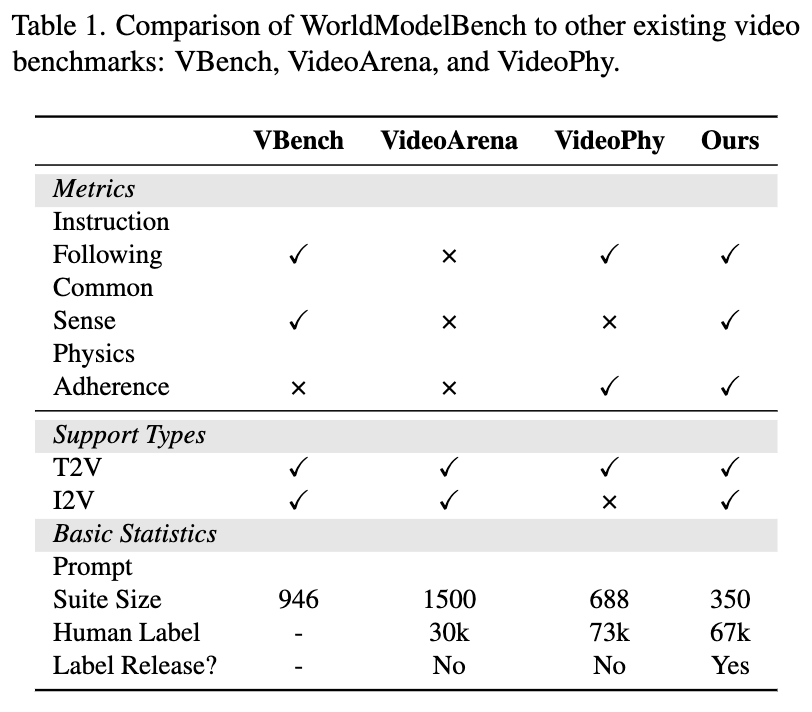

| Category | Metric | VBench | VideoArena | VideoPhy | Ours |
|---|---|---|---|---|---|
| Metrics | Instruction Following | ✓ | × | ✓ | ✓ |
|  | Common Sense | ✓ | × | × | ✓ |
|  | Physics Adherence | × | × | ✓ | ✓ |
| Support Types | T2V | ✓ | ✓ | ✓ | ✓ |
|  | I2V | ✓ | ✓ | × | ✓ |
| Basic Statistics | Prompt Suite Size | 946 | 1500 | 688 | 350 |
|  | Human Label | - | 30k | 73k | 67k |
|  | Label Release? | - | No | No | Yes |

---

**Table 2: Vote statistics of WorldModelBench.**

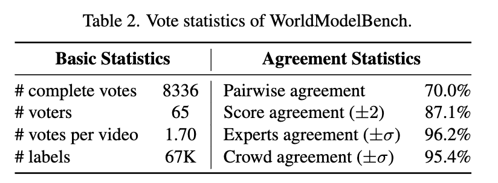

| Basic Statistics | Value | Agreement Statistics | Value |
|---|---|---|---|
| # complete votes | 8336 | Pairwise agreement | 70.0% |
| # voters | 65 | Score agreement (±2) | 87.1% |
| # votes per video | 1.70 | Experts agreement (±σ) | 96.2% |
| # labels | 67K | Crowd agreement (±σ) | 95.4% |

---

**Table 3: Model performance on WorldModelBench on human annotations. Bold and underline indicates the best performance over all models, and open models respectively. "Deform.", "Penetr.", "Grav." is short for "Deformation", "Penetration", "Gravitation".**

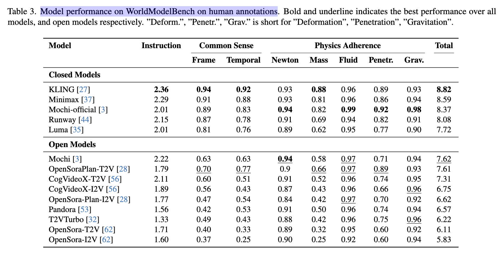

| Group | Model | Instruction | Common Sense (Frame) | Common Sense (Temporal) | Physics Adherence (Newton) | Physics Adherence (Mass) | Physics Adherence (Fluid) | Physics Adherence (Penetr.) | Physics Adherence (Grav.) | Total |
|---|---|---|---|---|---|---|---|---|---|---|
| Closed Models | KLING [27] | **2.36** | **0.94** | **0.92** | 0.93 | **0.88** | 0.96 | 0.89 | 0.93 | **8.82** |
|  | Minimax [37] | 2.29 | 0.91 | 0.88 | 0.93 | 0.81 | 0.96 | 0.86 | 0.94 | 8.59 |
|  | Mochi-official [3] | 2.01 | 0.89 | 0.83 | **0.94** | 0.82 | **0.99** | **0.92** | **0.98** | 8.37 |
|  | Runway [44] | 2.15 | 0.87 | 0.78 | 0.91 | 0.69 | 0.94 | 0.82 | 0.91 | 8.08 |
|  | Luma [35] | 2.01 | 0.81 | 0.76 | 0.89 | 0.62 | 0.95 | 0.77 | 0.90 | 7.72 |
| Open Models | Mochi [3] | 2.22 | 0.63 | 0.63 | **<u>0.94</u>** | 0.58 | <u>0.97</u> | 0.71 | 0.94 | <u>7.62</u> |
|  | OpenSoraPlan-T2V [28] | 1.79 | <u>0.70</u> | <u>0.77</u> | 0.9 | <u>0.66</u> | <u>0.97</u> | <u>0.89</u> | 0.93 | 7.61 |
|  | CogVideoX-T2V [56] | 2.11 | 0.60 | 0.51 | 0.91 | 0.52 | 0.96 | 0.74 | 0.95 | 7.31 |
|  | CogVideoX-I2V [56] | 1.89 | 0.56 | 0.43 | 0.87 | 0.43 | 0.96 | 0.66 | <u>0.96</u> | 6.75 |
|  | OpenSora-Plan-I2V [28] | 1.77 | 0.47 | 0.54 | 0.84 | 0.42 | <u>0.97</u> | 0.70 | 0.92 | 6.62 |
|  | Pandora [53] | 1.56 | 0.42 | 0.53 | 0.91 | 0.50 | 0.96 | 0.74 | 0.94 | 6.57 |
|  | T2VTurbo [32] | 1.33 | 0.49 | 0.43 | 0.88 | 0.42 | 0.96 | 0.75 | <u>0.96</u> | 6.22 |
|  | OpenSora-T2V [62] | 1.71 | 0.40 | 0.33 | 0.89 | 0.32 | 0.95 | 0.60 | 0.92 | 6.11 |
|  | OpenSora-I2V [62] | 1.60 | 0.37 | 0.25 | 0.90 | 0.25 | 0.92 | 0.60 | 0.94 | 5.83 |

---

**Table 4: Score comparison between scores provided by humans and the judge model. The averaged predicting error (1/n Σ |Judge − Human| / Human) is 4.1%. The highest prediction error is 6.81%, showing the reliability of our judge model.**

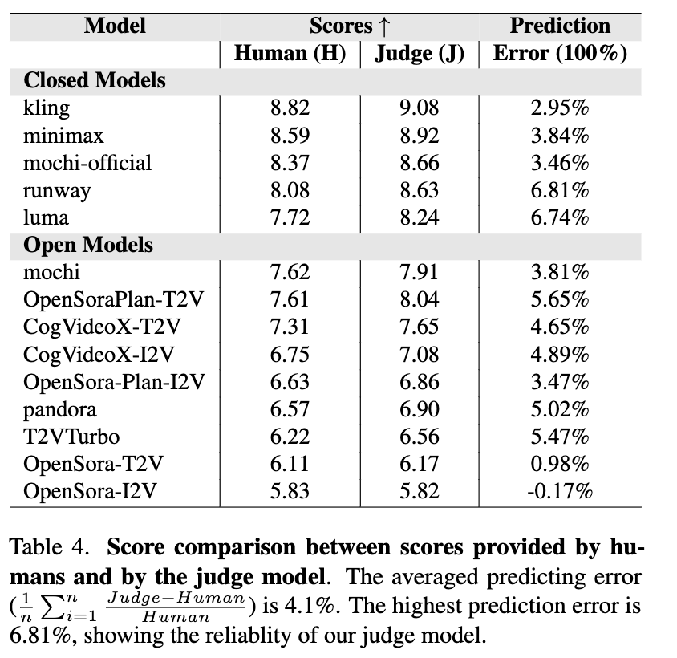

| Group | Model | Scores↑ Human (H) | Scores↑ Judge (J) | Prediction Error (100%) |
|---|---|---|---|---|
| Closed Models | kling | 8.82 | 9.08 | 2.95% |
|  | minimax | 8.59 | 8.92 | 3.84% |
|  | mochi-official | 8.37 | 8.66 | 3.46% |
|  | runway | 8.08 | 8.63 | 6.81% |
|  | luma | 7.72 | 8.24 | 6.74% |
| Open Models | mochi | 7.62 | 7.91 | 3.81% |
|  | OpenSoraPlan-T2V | 7.61 | 8.04 | 5.65% |
|  | CogVideoX-T2V | 7.31 | 7.65 | 4.65% |
|  | CogVideoX-I2V | 6.75 | 7.08 | 4.89% |
|  | OpenSora-Plan-I2V | 6.63 | 6.86 | 3.47% |
|  | pandora | 6.57 | 6.90 | 5.02% |
|  | T2VTurbo | 6.22 | 6.56 | 5.47% |
|  | OpenSora-T2V | 6.11 | 6.17 | 0.98% |
|  | OpenSora-I2V | 5.83 | 5.82 | -0.17% |

---

**Table 5: Model prediction error results of different judge choices on WorldModelBench. VILA-2B is a vision-language model with 2B parameters, trained on image and video understanding tasks [33]. We report the average error rate between the model's predictions and the ground truth.**

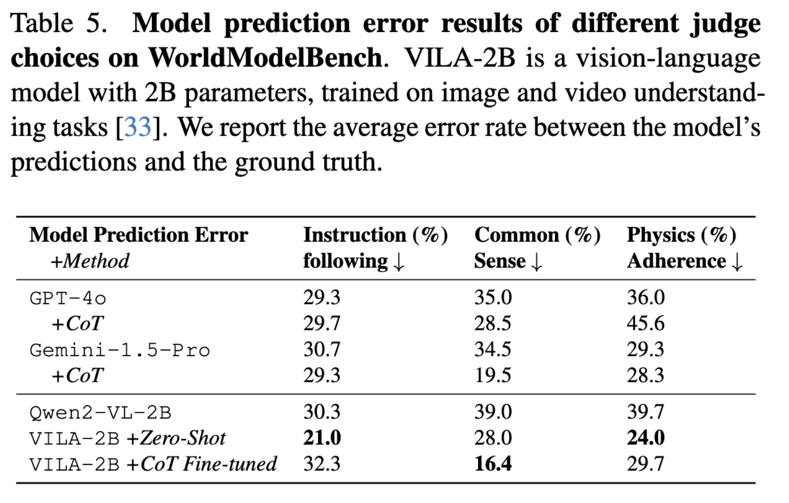

| Model Prediction Error +Method | Instruction (%) following ↓ | Common (%) Sense ↓ | Physics (%) Adherence ↓ |
|---|---|---|---|
| GPT-4o | 29.3 | 35.0 | 36.0 |
| +CoT | 29.7 | 28.5 | 45.6 |
| Gemini-1.5-Pro | 30.7 | 34.5 | 29.3 |
| +CoT | 29.3 | 19.5 | 28.3 |
| Qwen2-VL-2B | 30.3 | 39.0 | 39.7 |
| VILA-2B +Zero-Shot | **21.0** | 28.0 | **24.0** |
| VILA-2B +CoT Fine-tuned | 32.3 | **16.4** | 29.7 |

---

# Paper 5 — WorldScore: A Unified Evaluation Benchmark for World Generation

**Table 1: Comparison of Benchmarks. Our WorldScore benchmark is designed to evaluate various world generation approaches including 3D, 4D, I2V and T2V models. It is designed to generate multiple scenes with varying sequence lengths. Our benchmark also features multiple visual styles, accurate camera control evaluation, and 3D consistency evaluation, all of which are important factors in world generation yet currently missing in existing benchmarks.**

| Benchmark | # Examples | Multi-Scene | Unified | Long Seq. | Image Cond. | Multi-Style | Camera Ctrl. | 3D Consist. |
|---|---|---|---|---|---|---|---|---|
| TC-Bench [15] | 150 | ✗ | ✗ | ✗ | ✓ | ✗ | ✗ | ✗ |
| EvalCrafter [45] | 700 | ✗ | ✗ | ✗ | ✗ | ✗ | ✗ | ✗ |
| FETV [46] | 619 | ✗ | ✗ | ✗ | ✗ | ✗ | ✗ | ✗ |
| VBench [26] | 800 | ✗ | ✗ | ✗ | ✗ | ✗ | ✗ | ✗ |
| T2V-CompBench [71] | 700 | ✗ | ✗ | ✗ | ✗ | ✗ | ✗ | ✗ |
| Meng et al. [48] | 160 | ✗ | ✗ | ✗ | ✗ | ✗ | ✗ | ✗ |
| Wang et al. [78] | 423 | ✗ | ✗ | ✓ | ✗ | ✗ | ✗ | ✗ |
| ChronoMagic-Bench [92] | 1649 | ✗ | ✗ | ✗ | ✗ | ✗ | ✗ | ✗ |
| WorldModelBench [40] | 350 | ✗ | ✗ | ✗ | ✓ | ✗ | ✗ | ✗ |
| WorldScore (Ours) | 3000 | ✓ | ✓ | ✓ | ✓ | ✓ | ✓ | ✓ |

---

**Table 2: WorldScore evaluation of 20 world generation models. Top: Close-source video models. Middle: Open-source video models. Bottom two rows: 3D and 4D models. Abbreviations: Ctrl=Controllability, Align=Alignment, Consist=Consistency, Photo=Photometric, Qual=Quality, Acc=Accuracy, Mag=Magnitude, Smooth=Smoothness.**

| Models | WorldScore -Static | WorldScore -Dynamic | Controllability Camera Ctrl | Controllability Object Ctrl | Controllability Content Align | Controllability 3D Consist | Quality Photo Consist | Quality Style Consist | Quality Subjective Qual | Dynamics Motion Acc | Dynamics Motion Mag | Dynamics Motion Smooth |
|---|---|---|---|---|---|---|---|---|---|---|---|---|
| Gen-3 [58] | 60.71 | <u>57.58</u> | 29.47 | <u>62.92</u> | 50.49 | 68.31 | 87.09 | 62.82 | 63.85 | 54.53 | 27.48 | 68.87 |
| Hailuo [20] | 57.55 | 56.36 | 22.39 | **69.56** | <u>73.53</u> | 67.18 | 62.82 | 54.91 | 52.44 | 63.46 | 27.20 | 70.07 |
| DynamiCrafter [84] | 52.09 | 47.19 | 25.15 | 47.36 | 25.00 | 72.90 | 60.95 | <u>78.85</u> | 54.40 | 41.11 | 39.25 | 26.92 |
| VideoCrafter1-T2V [9] | 47.10 | 43.54 | 21.61 | 50.44 | 60.78 | 64.86 | 51.36 | 38.05 | 42.63 | 11.76 | **75.00** | 18.87 |
| VideoCrafter1-I2V [9] | 50.47 | 47.64 | 25.46 | 24.25 | 35.27 | 74.42 | 73.89 | 65.17 | 54.85 | 55.63 | 25.00 | 42.49 |
| VideoCrafter2 [9] | 52.57 | 47.49 | 28.92 | 39.07 | 72.46 | 65.14 | 61.85 | 43.79 | 56.74 | 47.12 | 30.40 | 29.39 |
| T2V-Turbo [41] | 45.65 | 40.20 | 27.80 | 30.68 | 69.14 | 38.72 | 34.84 | 49.65 | **68.74** | 34.87 | 40.09 | 7.48 |
| EasyAnimate [86] | 52.85 | 51.65 | 26.72 | 54.50 | 50.76 | 67.29 | 47.35 | 73.05 | 50.31 | <u>75.00</u> | 31.16 | 40.32 |
| Allegro [97] | 55.31 | 51.97 | 24.84 | 57.47 | 51.48 | 70.50 | 69.89 | 65.60 | 47.41 | 54.39 | 40.28 | 37.81 |
| Vchitect-2.0 [14] | 42.28 | 38.47 | 26.55 | 49.54 | 65.75 | 41.53 | 42.30 | 25.69 | 44.58 | 33.59 | 33.81 | 21.31 |
| LTX-Video [19] | 55.44 | 56.54 | 25.06 | 53.41 | 39.73 | 78.41 | 88.92 | 53.50 | 49.08 | **76.22** | 29.95 | <u>71.09</u> |
| CogVideoX-T2V [88] | 54.18 | 48.79 | 40.22 | 51.05 | 68.12 | 68.81 | 64.20 | 42.19 | 44.67 | 25.00 | <u>47.31</u> | 36.28 |
| CogVideoX-I2V [88] | 62.15 | **59.12** | 38.27 | 40.07 | 36.73 | 86.21 | 88.12 | **83.22** | 62.44 | 69.56 | 26.42 | 60.15 |
| SceneScape [16] | 50.73 | 35.51 | 84.99 | 47.44 | 28.64 | 76.54 | 62.88 | 21.85 | 32.75 | 0.00 | 0.00 | 0.00 |
| Text2Room [24] | 62.10 | 43.47 | **94.01** | 38.93 | 50.79 | <u>88.71</u> | 88.36 | 37.23 | 36.69 | 0.00 | 0.00 | 0.00 |
| LucidDreamer [11] | <u>70.40</u> | 49.28 | 88.93 | 41.18 | **75.00** | **90.37** | **90.20** | 48.10 | 58.99 | 0.00 | 0.00 | 0.00 |
| WonderJourney [90] | 63.75 | 44.63 | 84.60 | 37.10 | 35.54 | 80.60 | 79.03 | 62.82 | <u>66.56</u> | 0.00 | 0.00 | 0.00 |
| InvisibleStitch [12] | 61.12 | 42.78 | <u>93.20</u> | 36.51 | 29.53 | 88.51 | <u>89.19</u> | 32.37 | 58.50 | 0.00 | 0.00 | 0.00 |
| WonderWorld [91] | **72.69** | 50.88 | 92.98 | 51.76 | 71.25 | 86.87 | 85.56 | 70.57 | 49.81 | 0.00 | 0.00 | 0.00 |
| 4D-fy [3] | 27.98 | 32.10 | 69.92 | 55.09 | 0.85 | 35.47 | 1.59 | 32.04 | 0.89 | 22.22 | 22.88 | **80.06** |

---

# Paper 6 — WorldSimBench: Towards Video Generation Models as World Simulators

**Table 1: Comparisons between existing Predictive Model benchmarks. Interactive Environment refers to the interaction with the simulation environment during the prediction phase. Task-Level Interaction denotes that each task interacts once, whereas Action-Level Interaction represents the frequency of interactions that occur through the generation of actions for control purposes.**

| Benchmark | Input Modality | Output Modality | Based Method | Stage | Interactive Env. | Evaluation Strategy |
|---|---|---|---|---|---|---|
| AgentBench (Liu et al., 2023b) | Text | Text | LLM | S0 | Task-Level | Human Judgement |
| EgoPlan-Bench (Chen et al., 2023) | Text & Images | Text | MLLM | S0 | N/A | Multi-choice |
| MMWorld (He et al., 2024) | Text & Images | Text | MLLM | S0 | N/A | GPT Judgement |
| VAB (Liu et al., 2024a) | Text & Images | Text | MLLM | S0 | Task-Level | Human Judgement |
| LEGO (Lai et al., 2023) | Text & Images | Image | IGM | S1 | Task-Level | Feature Similarity |
| VBench (Huang et al., 2024) | Text | Video | VGM | S2 | N/A | Feature Similarity |
| EvalCrafter (Liu et al., 2024b) | Text & Images | Video | VGM | S2 | N/A | Feature Similarity |
| WorldSimBench | Text & Images | Actionable Video | VGM | S3 | Action-Level | Human Preference Evaluator Embodied Metric |

---

**Table 2: Hierarchical Evaluation Dimension. The dimensions are categorized into three main aspects: Visual Quality for evaluating the overall quality, Condition Consistency for evaluating the alignment to the input instruction, and Embodiment for evaluating embodied related factors like physical rules.**

| Embodied Scenarios | Visual Quality | Condition Consistency | Embodiment |
|---|---|---|---|
| Open-Ended Embodied Environment (OE) | Background Consistency (BC) Foreground Consistency (FC) | Instruction Alignment (IA) Scenario Alignment (SA) | Velocity (VC) Trajectory (TJ) Embodied Interaction (EI) |
| Autonomous Driving (AD) | Aesthetics (AE) | Instruction Alignment (IA) | Perspectivity (PV) Trajectory (TJ) Key Element (KE) Safety (SF) |
| Robot Manipulation (RM) | Aesthetics (AE) Background Consistency (BC) Foreground Consistency (FC) | Instruction Alignment (IA) | Perspectivity (PV) Trajectory (TJ) Embodied Interaction (EI) |

---

**Table 3: The overall performance comparison between Human Preference Evaluator and GPT-4o. HPE indicates Human Preference Evaluator. HPE@Lavie means that HPE is trained on videos except those generated by Lavie. The validation is conducted on videos generated by Laive under zero-shot setting.**

| Embodied Scenario | GPT-4o | HPE | GPT-4o@OpenSora | HPE@OpenSora | GPT-4o@Lavie | HPE@Lavie |
|---|---|---|---|---|---|---|
| OE@Acc(↑) | 72.8 | **89.4** | 66.5 | **71.6** | 78.5 | **87.9** |
| AD@PLCC(↑) | 0.28 | **0.60** | 0.03 | **0.34** | -0.04 | **0.49** |
| RM@PLCC(↑) | 0.07 | **0.43** | -0.06 | **0.47** | 0.17 | **0.44** |

---

